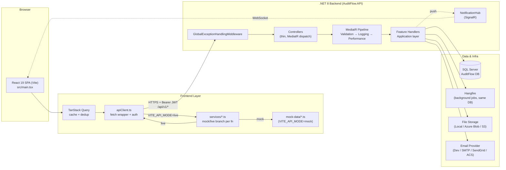
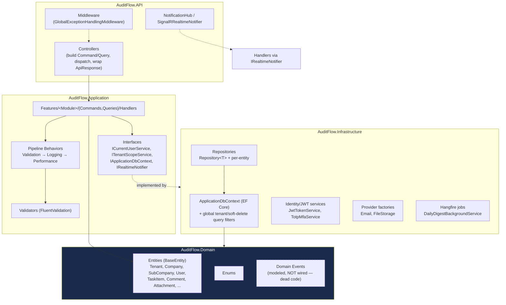
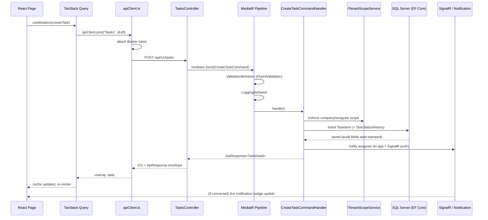
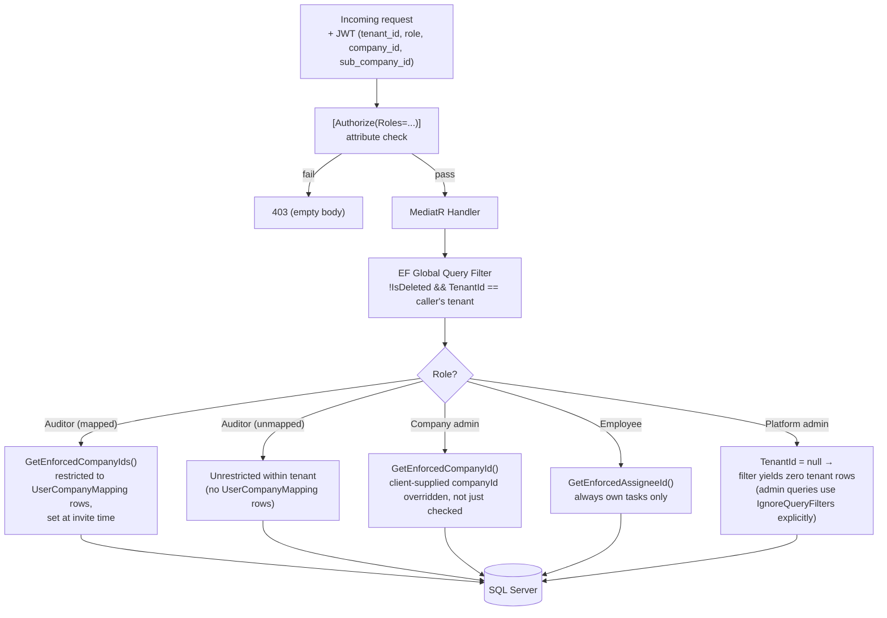
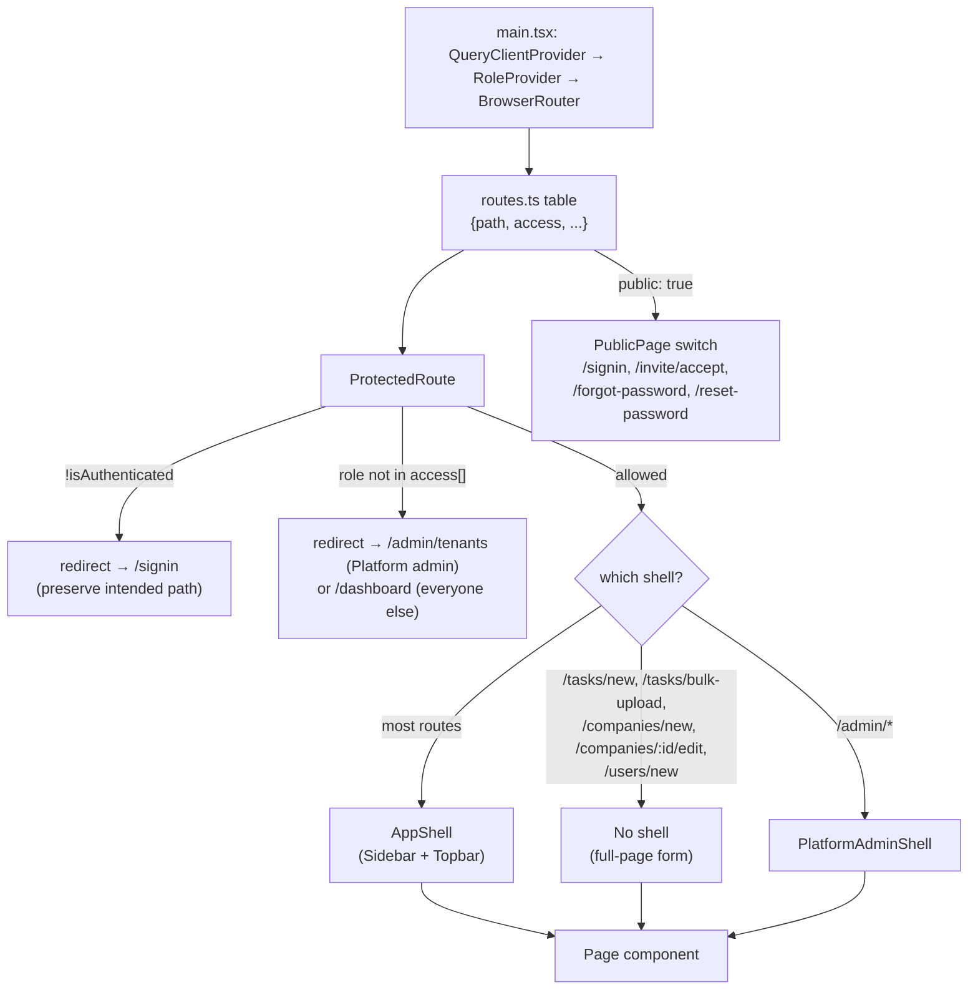
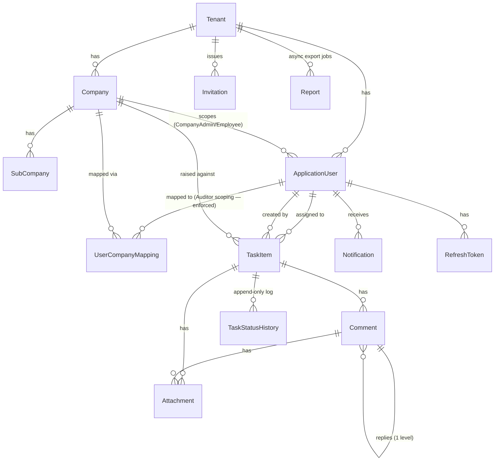

# AuditFlow — Architecture & Flow Diagrams

> Companion to [`PROJECT_CONTEXT.md`](./PROJECT_CONTEXT.md) (narrative context, roles, gaps). This file is the visual/structural reference — system topology, request lifecycle, auth flow, tenancy model, and module maps. Diagrams use Mermaid (renders natively on GitHub and in most Markdown viewers).

---

## 1. System Overview



---

## 2. Backend: Clean Architecture Layers



**Dependency rule:** `API → Application → Domain`, `Infrastructure → Application → Domain`. Domain never references anything else. `AuditFlow.Shared` is scaffold-only, ignore.

---

## 3. Request Lifecycle (a typical write, e.g. "create Task")



**On 401:** `apiClient.ts` performs a single-flight refresh (`POST /auth/refresh`), retries the original request once; if refresh fails, clears tokens, calls the registered `unauthorizedHandler` (wired by `RoleContext`), and clears the whole Query cache.

---

## 4. Multi-Tenancy & Access Scoping



Key point: tenant isolation is **row-level, shared database** — not database-per-tenant. Two independent layers enforce it: the EF global filter (tenant boundary) and `ITenantScopeService` (company/assignee boundary within a tenant). Both are server-side; the frontend's `routes.ts` access map is a UX convenience on top, not the actual security boundary.

---

## 5. Auth & Session Flow

```mermaid
sequenceDiagram
    participant UI as SignInPage
    participant AC as apiClient
    participant AUTH as AuthController
    participant DB as SQL Server

    UI->>AC: POST /auth/login {email, password}
    AC->>AUTH: forward
    AUTH->>DB: verify credentials (Identity)
    alt MFA enabled
        AUTH-->>UI: { requiresMfa: true } (no tokens)
        UI->>AUTH: POST /auth/login { ..., mfaCode }
        AUTH->>DB: verify TOTP / recovery code
    end
    AUTH->>DB: issue access token (60min) + refresh token (7d, SHA-256 hashed)
    AUTH-->>UI: { accessToken, refreshToken, expiresAt }
    UI->>UI: tokenStorage.set (sessionStorage; also localStorage if "Keep me signed in")
    UI->>UI: jwt-decode → RoleContext user (role, tenantId, companyId, ...)

    Note over UI,AUTH: Later — any 401 response
    UI->>AUTH: POST /auth/refresh (single-flight, deduped)
    AUTH->>DB: validate + rotate refresh token\n(reuse detection: replay revokes ALL sessions)
    AUTH-->>UI: new token pair
    UI->>UI: retry original request once
```

Frontend role bootstrap (`RoleContext.tsx`): in `mock` mode, restores a fake session from `localStorage` flags with a topbar role-switcher for manual testing; in `live` mode, role/tenant/company are **purely JWT-derived** — there is no separate "current user" fetch on boot beyond decoding the stored token.

**Token storage is `sessionStorage`-first, not `localStorage`** (changed 2026-08-11 — see `PROJECT_CONTEXT.md` §4 for the full "why", it was a real cross-account data-leak bug, not a preference). On load, `tokenStorage.ts` copies an existing `localStorage` session into `sessionStorage` *only if this tab doesn't already have its own* — so a tab that has ever independently logged in stays fully isolated from whatever any other tab does afterward. `apiClient.ts`'s `skipAuth` option keeps public endpoints (login, forgot/reset-password, invite validate/accept) from ever attaching a stray token from an unrelated session, which otherwise tripped the backend's tenant query filter on requests that should never have been treated as authenticated at all.

---

## 6. Frontend Routing & Shell Selection



If a route exists in `routes.ts` but has no matching branch in `main.tsx`'s switch, it silently renders `PlaceholderPage`. `/admin/audit-log` was the one real remaining case of this — fixed 2026-08-11 (`AuditLogPage`, filters + pagination against the `GET /admin/audit-log` endpoint, which already existed backend-side).

---

## 7. Module ↔ Layer Map

Quick lookup: which frontend service and backend controller/handler folder own a given feature area.

| Module | Frontend service | Frontend pages | Backend controller | Backend feature folder | Key DB tables |
|---|---|---|---|---|---|
| Auth | `services/auth.ts` | SignInPage, AcceptInvitePage, ForgotPasswordPage, ResetPasswordPage | `AuthController`, invite endpoints | `Features/Auth` | Users (Identity), RefreshTokens, Invitations |
| Profile | `services/users.ts` (`/users/me*`) | ProfilePage | `UsersController` | `Features/Users` | Users |
| Dashboard | `services/dashboard.ts` | DashboardPage (Standard + Executive) | `DashboardController` | `Features/Dashboard` | Tasks, Companies (read-only aggregates) |
| Companies | `services/companies.ts` | CompanyManagementPage, CompanyFormPage | `CompaniesController` | `Features/Companies` | Companies, SubCompanies |
| Users | `services/users.ts` | UserManagementPage, InviteUserPage | `UsersController` | `Features/Users` | Users, Invitations, UserCompanyMappings |
| Tasks | `services/tasks.ts` | TaskGridPage, TaskCreatePage, TaskBulkCreatePage, TaskDetailsPage | `TasksController` | `Features/Tasks` | Tasks, Comments, Attachments, TaskStatusHistories |
| Reports | `services/reports.ts` | ReportsPage | `ReportsController` | `Features/Reports` | Tasks (query), Reports (async export jobs) |
| Notifications | `services/notifications.ts` | NotificationsPage, Topbar bell | `NotificationsController`, `NotificationHub` | `Features/Notifications` | Notifications |
| Platform Admin | `services/admin.ts` | PlatformAdminPages.tsx | `AdminController` | `Features/Admin` | Tenants, cross-tenant aggregates |
| Files | (embedded in `services/tasks.ts` uploads) | TaskDetailsPage attachments | `FilesController` | (Infrastructure file-storage factory) | Attachments |

Backend-side, `ArchitectureFlow.md` (backend repo root) has a deeper "which files to open" index per module — prefer it over re-deriving file lists by grepping.

---

## 8. Data Model Snapshot



Full column-level schema, indexes, and the module→table map live in the backend repo's `DatabaseStructure.md` — not duplicated here since it changes with migrations; re-read it directly when schema accuracy matters.

---

## 9. Known Architectural Gaps (see `PROJECT_CONTEXT.md` §3/§5 for full detail)

- Domain events subsystem: modeled, never wired.
- `AuditLog`/`TaskStatusHistory`: meant to be soft-delete-immune, not cleanly excluded from the global filter yet.
- Frontend debounce: only `GlobalSearch` (250ms); not centralized in `apiClient.ts` despite the horizontal-scale goal of baking dedup/debounce into the API layer.
- No CI/CD, no Dockerfile, no production secrets wired — deploy-readiness gaps, not functional gaps.
