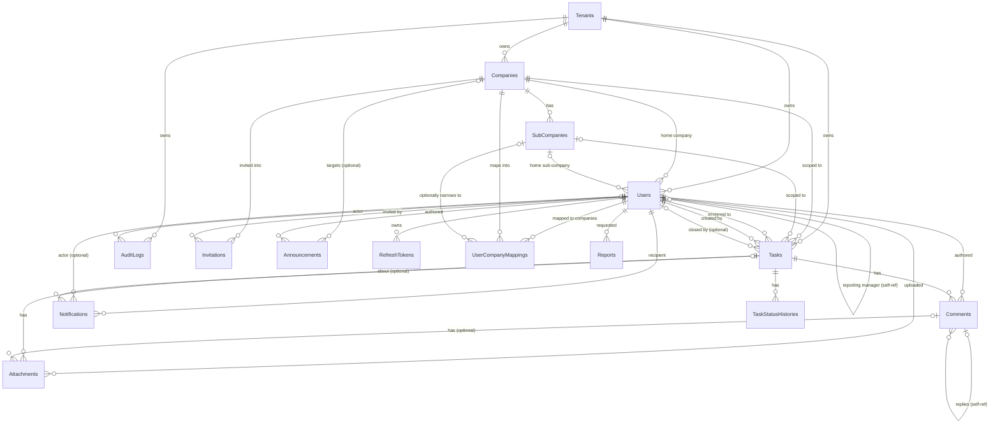

# AuditFlow — Database Structure

This document explains the AuditFlow SQL Server database as it exists today: every table, what it's
for, how tables relate to each other, and which backend module(s) read/write each one. It's generated
from the actual EF Core entity classes and Fluent configurations in `src/AuditFlow.Domain/Entities` and
`src/AuditFlow.Infrastructure/Configurations` (not from a separate design doc), so it reflects the real
schema produced by the migrations in `src/AuditFlow.Infrastructure/Persistence/Migrations`.

## 1. Tech stack

- **EF Core 8**, code-first, SQL Server provider (`Microsoft.EntityFrameworkCore.SqlServer`)
- **ASP.NET Core Identity** (`IdentityDbContext<ApplicationUser, IdentityRole<Guid>, Guid>`) supplies the
  `Users` table's authentication columns (password hash, security stamp, etc.) and a handful of
  Identity-scaffolded tables (see [§7](#7-aspnet-identity-tables))
- **Hangfire** (SQL Server storage) shares the same database for its background-job tables (see
  [§8](#8-non-domain-tables-hangfire--ef-migrations-history))
- All primary keys are `Guid` (`uniqueidentifier`), generated in application code, not by the database
- One `ApplicationDbContext` (`src/AuditFlow.Infrastructure/Persistence/ApplicationDbContext.cs`) owns
  every table and every relationship in this document

## 2. The big picture: how the tenancy hierarchy works

Everything in AuditFlow hangs off one hierarchy:

```
Tenant  (an audit firm's account, e.g. "Smith & Co Auditors")
  └─ Company  (one of the firm's audit clients, e.g. "Acme Corp")
       └─ SubCompany  (a division/region within that client, e.g. "Acme West")
            └─ User  (Employee/CompanyAdmin/Auditor/PlatformAdmin)
```

- A **Tenant** is what the Admin module calls an "Auditor Account" — the paying customer. All of a
  tenant's Companies, Users, Tasks, and AuditLogs are scoped under its `TenantId`.
- A **Company** is one of that audit firm's clients. Companies belong to exactly one Tenant.
- A **SubCompany** is an optional division within a Company (Tasks and Users can be scoped to a
  SubCompany, or just to the Company directly if there's no sub-division).
- A **User** always belongs to a Company (and optionally a SubCompany) except `PlatformAdmin` (owns the
  whole platform, no tenant) and `Auditor` (owns the Tenant itself; can additionally be mapped to
  *multiple* Companies via `UserCompanyMappings` — see §5.2).

Almost every other table (Tasks, Comments, Attachments, Notifications, AuditLogs, Invitations,
Announcements, Reports, UserCompanyMappings) carries its own `TenantId` column and is filtered by it
automatically — see §3.

## 3. Two enforcement layers baked into every query

These aren't separate tables, but they explain *why* the schema looks the way it does, so they're worth
understanding before the table reference below.

**1. Global query filters (tenant isolation + soft delete).** `ApplicationDbContext.OnModelCreating`
calls `ConfigureGlobalFilters(...)`, which attaches a `HasQueryFilter(...)` to nearly every entity:
`!IsDeleted && (TenantId == <the calling user's tenant>)`. This runs on *every* LINQ query against that
`DbSet`, automatically — a handler can't accidentally leak another tenant's rows just by forgetting a
`.Where()` clause. Two tables are audit trails and deliberately **don't** filter on `IsDeleted` (nothing
ever soft-deletes them, and they shouldn't silently vanish even if that changes): `AuditLogs` and
`TaskStatusHistories`. `RefreshTokens` only gets the soft-delete half of the filter (it's looked up by
token hash before a tenant is even known).

**2. Soft delete.** Every table inheriting `BaseEntity` (i.e. every custom table in this database) has
`IsDeleted` / `DeletedAt` / `DeletedBy` columns. Nothing is ever hard-deleted from application code —
"delete" always means `SetDeleted()`, which the global filter then hides from normal queries.

Both of these mean: **every table below that has a `TenantId` column is protected by the tenant filter,
and every table has the soft-delete columns**, even where the table reference doesn't call them out
individually.

## 4. Entity-relationship diagram



*(Cardinality reads left-to-right: `||` = exactly one / required, `|o` = zero-or-one / optional,
`o{` = zero-or-more.)*

## 5. Table reference

### 5.1 Tenancy & organization structure

#### `Tenants`
The audit firm's account (called "Auditor Account" in the Admin API/UI). The root of the whole hierarchy.

| Column | Notes |
|---|---|
| `Name`, `Domain` (unique), `Description` | `Domain` has a unique index |
| `Plan` | free-text plan label (`Starter`/`Growth`/`Scale`/`Enterprise` by convention, not a DB constraint) |
| `Status` | `AuditorStatus` enum: Onboarding / Active / Suspended / Cancelled |
| `PrimaryContactEmail`, `PrimaryContactName` | |
| `TrialEndsAt`, `SubscriptionEndsAt` | nullable |

Children: `Companies`, `Users`, `Tasks`, `AuditLogs` (all `OnDelete: Cascade` from Tenant except `Users`,
which is `Restrict` — you can't delete a Tenant out from under its Users without dealing with them first).

#### `Companies`
One of the tenant's audit clients.

| Column | Notes |
|---|---|
| `Name`, `Industry`, `PrimaryContactEmail` | |
| `TenantId` (FK → Tenants) | `OnDelete: Cascade` |
| `Status` | `CompanyStatus` enum: Active / Inactive / Onboarding |
| `OnboardedAt` | nullable |

Index: `(TenantId, Name)`. Children: `SubCompanies` (Cascade), `Users` (Restrict), `Tasks` (Restrict).

#### `SubCompanies`
An optional division/region within a Company.

| Column | Notes |
|---|---|
| `Name`, `Description` | |
| `CompanyId` (FK → Companies) | `OnDelete: Cascade` |
| `TenantId` | **Denormalized** copy of `Company.TenantId` — see callout below |
| `IsActive` | |

> **Why `SubCompany.TenantId` is denormalized:** the global tenant filter (§3) needs a `TenantId` column
> to filter on directly; without duplicating it here, every query against `SubCompanies` would need an
> extra join into `Companies` just to know which tenant it belongs to. It's kept in sync at creation time
> and never changes independently of `Company.TenantId`.

Index: `(CompanyId, Name)`. Children: `Users` (Restrict), `Tasks` (Restrict).

### 5.2 Identity & access

#### `Users` (the `ApplicationUser` entity — table renamed from Identity's default `AspNetUsers`)
Every human account: PlatformAdmin, Auditor, CompanyAdmin, Employee. Extends ASP.NET Identity's
`IdentityUser<Guid>`, so it carries the usual Identity columns (`Email`, `PasswordHash`,
`SecurityStamp`, `ConcurrencyStamp`, `PhoneNumber`, lockout fields, etc.) *plus* everything below.

| Column | Notes |
|---|---|
| `FullName`, `Role` (`UserRole` enum), `Status` (`UserStatus` enum: Invited/Active/Deactivated) | |
| `TenantId`, `CompanyId`, `SubCompanyId` | all nullable FKs — a user's "home" org placement |
| `ReportingManagerId` (self-FK → Users) | optional; `ExternalReportingManagerEmail` covers a manager outside the system |
| `InvitedAt`, `ActivatedAt`, `LastLoginAt`, `InvitationToken`, `InvitationTokenExpiresAt` | invite/activation lifecycle |
| `MfaEnabled`, `MfaSecret`, `MfaRecoveryCodes` | TOTP MFA state |
| `Theme`, `EmailNotificationsEnabled`, `InAppNotificationsEnabled`, `DailyDigestEnabled` | per-user preferences |

Indexes: unique `(TenantId, Email)` filtered to `IsDeleted = 0` (so a deleted user's email can be
reused within the same tenant), `(CompanyId, Role)`, and a filtered index on `InvitationToken`.

Relationships fan out in every direction — a `Users` row is referenced by `Tasks` (assigned-to,
created-by, closed-by), `Comments`, `Attachments`, `Notifications` (recipient and actor),
`AuditLogs`, `RefreshTokens`, `UserCompanyMappings`, `Reports`, `Invitations` (invited-by,
accepted-by), `Announcements`, and itself (`ReportingManagerId` / `ManagedUsers`). Almost all of
these FKs are `OnDelete: Restrict` deliberately — a user is never allowed to disappear out from under
their history; they get soft-deleted (`Deactivate()`), not removed.

#### `UserCompanyMappings`
Explicit many-to-many: which Companies (optionally narrowed to one SubCompany) a user can see, beyond
their single "home" `CompanyId`/`SubCompanyId` on the `Users` row itself. This is what lets **one Auditor
be mapped across several of their firm's Companies** at once (an Employee/CompanyAdmin only ever needs
their home company, so in practice this table is populated for Auditor-role users).

| Column | Notes |
|---|---|
| `UserId` (FK → Users, Cascade) | |
| `CompanyId` (FK → Companies, Restrict) | |
| `SubCompanyId` (FK → SubCompanies, Restrict, nullable) | |
| `TenantId` | |

Unique index on `(UserId, CompanyId, SubCompanyId)` — the same user can't be mapped to the same
company/sub-company pair twice.

#### `Invitations`
A pending (or resolved) invite for someone to join as a User. No Fluent configuration override exists
for this table — EF applies it purely from the entity's data annotations and naming conventions, table
name `Invitations`.

| Column | Notes |
|---|---|
| `Email`, `FullName`, `Role` | what the invited person will become |
| `TenantId`, `CompanyId`, `SubCompanyId` | where they'll land |
| `ReportingManagerId`, `ExternalReportingManagerEmail` | |
| `Token`, `Status` (`InvitationStatus`: Pending/Accepted/Expired/Revoked), `ExpiresAt`, `AcceptedAt` | |
| `InvitedByUserId`, `AcceptedByUserId` (FK → Users) | |

#### `RefreshTokens`
One row per issued refresh token, rotated on every use.

| Column | Notes |
|---|---|
| `UserId` (FK → Users, Cascade) | |
| `TokenHash` | **SHA-256 hash only** — the raw token value is never persisted, so a DB read alone can't be replayed as a session |
| `ExpiresAt`, `RevokedAt`, `ReplacedByTokenHash` | rotation chain |

Unique index on `TokenHash`; index on `(UserId, ExpiresAt)` (used to revoke all of a user's active
sessions on password change).

### 5.3 Task management

#### `Tasks` (the `TaskItem` entity)
The core audit work item.

| Column | Notes |
|---|---|
| `TaskNumber` | human-facing ID, e.g. `TSK-20260724-ABCD1234`; unique per `(TenantId, TaskNumber)` |
| `Title`, `Description` | both covered by the full-text index described below |
| `Status` (`AuditTaskStatus`: Open/InProgress/Resolved/Closed/Reopened), `Priority` (`TaskPriority`: Low/Medium/High/Critical) | |
| `TenantId`, `CompanyId` (required), `SubCompanyId` (optional) | |
| `AssignedToUserId`, `CreatedByUserId`, `ClosedByUserId` (optional) | three separate FKs into `Users`, all `Restrict` |
| `DueDate`, `ResolvedAt`, `ClosedAt` | |

Indexes: unique `(TenantId, TaskNumber)`; `(TenantId, CompanyId, Status)`; `(TenantId, AssignedToUserId,
Status)`; `(DueDate, Status)`; `CreatedAt`; and a composite `(CompanyId, Status, CreatedAt DESC)` sized
specifically for the task-grid's default "filter by company+status, sort by newest" query. A SQL Server
**full-text index** (catalog `AuditFlowFullTextCatalog`) also covers `Title`+`Description` for the
`CONTAINS()`-based search used by task search/filtering.

Children: `Comments`, `Attachments`, `TaskStatusHistories` (all Cascade — deleting a Task takes its
whole conversation/history with it), `Notifications` (SetNull — a notification survives its task being
deleted, just loses the link).

#### `TaskStatusHistories`
Append-only audit trail of every status transition a Task has gone through. Never soft-deleted, never
filtered by `IsDeleted` (see §3).

| Column | Notes |
|---|---|
| `TaskId` (FK → Tasks, Cascade) | |
| `FromStatus`, `ToStatus` (`AuditTaskStatus`) | |
| `ChangedByUserId` (FK → Users, Restrict), `Reason` | |

Index: `(TaskId, CreatedAt)`.

#### `Comments`
Threaded comments on a Task (one level of nesting via `ParentCommentId`).

| Column | Notes |
|---|---|
| `Content`, `TaskId` (FK, Cascade), `AuthorId` (FK → Users, Restrict) | |
| `ParentCommentId` (self-FK, Restrict, nullable) | reply-to; `Replies` is the inverse collection |
| `IsEdited`, `EditedAt` | |

Index: `(TaskId, CreatedAt)`.

#### `Attachments`
Files uploaded either directly to a Task or to a specific Comment, with lightweight versioning.

| Column | Notes |
|---|---|
| `FileName`, `ContentType`, `FileSize`, `StoragePath`, `StorageProvider` (`FileStorageProvider`: Local/AzureBlob/AwsS3) | |
| `TaskId` (FK, Cascade, nullable), `CommentId` (FK, Restrict, nullable) | can belong to either (or neither, until linked) |
| `UploadedByUserId` (FK → Users, Restrict) | |
| `Version`, `PreviousVersionId` (self-FK, Restrict) | re-uploading a file creates a new version row pointing back at the old one, rather than overwriting it |

Indexes: `(TaskId, CreatedAt)`, `(CommentId, CreatedAt)`.

> **Why `Comment → Attachments` is `Restrict` instead of `Cascade`:** a Task already cascades directly
> into `Attachments` via its own `TaskId`. If `Comments → Attachments` also cascaded, SQL Server would
> see two possible cascade paths from the same `Tasks` row into `Attachments` (`Task→Attachment` and
> `Task→Comment→Attachment`) and refuse to create the schema ("may cause cycles or multiple cascade
> paths"). The same reasoning shows up again for `Notifications` below.

### 5.4 Notifications & announcements

#### `Notifications`
A user's notification inbox entry (in-app, email, or both — `Channel` records which; actual email
delivery is handled by the email service, this table just tracks the notification's identity/read-state).

| Column | Notes |
|---|---|
| `Title`, `Message`, `Type` (`NotificationType`: TaskAssigned/TaskStatusChanged/.../ReportReady), `Channel` (`NotificationChannel`: InApp/Email/Both) | |
| `UserId` (FK → Users, **Cascade** — recipient) | |
| `TaskId` (FK → Tasks, **SetNull**, nullable) | |
| `CommentId` (FK → Comments, Restrict, nullable), `ActorUserId` (FK → Users, Restrict, nullable) | both `Restrict` for the same multiple-cascade-path reason as Attachments above |
| `IsRead`, `ReadAt` | |

Indexes: `(UserId, IsRead, CreatedAt)` (the unread-inbox query), `(TaskId, CreatedAt)`.

#### `Announcements`
Tenant- or company-wide banner announcements (e.g. platform maintenance notices).

| Column | Notes |
|---|---|
| `Title`, `Content`, `TenantId`, `CreatedByUserId` (FK → Users) | |
| `StartsAt`, `ExpiresAt`, `IsActive`, `IsPinned` | visibility window |
| `TargetCompanyId` (FK → Companies, nullable) | `null` = visible tenant-wide; set = scoped to one Company |

No Fluent configuration override — conventions + data annotations only, same as `Invitations`.

### 5.5 Audit & compliance

#### `AuditLogs`
Immutable, append-only record of significant actions across the whole platform (login/logout, task
CRUD, status changes, user invites/activation, impersonation, etc. — see the `AuditAction` enum in §6).
Never soft-deleted, never filtered by `IsDeleted` (see §3) — this table is the compliance trail and is
meant to be permanent.

| Column | Notes |
|---|---|
| `EntityType`, `EntityId` | which row this log entry is about (polymorphic — no FK, just a type name + id) |
| `Action` (`AuditAction` enum) | |
| `OldValuesJson`, `NewValuesJson`, `MetadataJson` | free-form JSON snapshots, not structured columns |
| `UserId` (FK → Users, **SetNull**), `TenantId` (FK → Tenants, Cascade) | who did it / which tenant |
| `IpAddress`, `UserAgent`, `CorrelationId` | request context for tracing |

Indexes: `(EntityType, EntityId)`, `(TenantId, CreatedAt)`, `(UserId, CreatedAt)`, `CorrelationId`.

### 5.6 Reporting

#### `Reports`
A queued/generated report export. Exists so a large (>10,000 row) export can run as a background
Hangfire job instead of blocking the HTTP request or being rejected outright.

| Column | Notes |
|---|---|
| `Name`, `Type` (`ReportType`: TaskReport/UserActivityReport/CompanyPerformanceReport), `Format` (`ReportFormat`: Excel/Pdf), `Status` (`ReportStatus`: Pending/Generating/Completed/Failed) | |
| `StoragePath` | where the generated file landed once `Completed` |
| `ParametersJson` | the filter parameters the export was run with, serialized |
| `TotalRecords`, `ErrorMessage`, `CompletedAt` | |
| `RequestedByUserId` (FK → Users, Restrict), `TenantId` (FK → Tenants, Restrict) | |

Index: `(RequestedByUserId, CreatedAt)`.

## 6. Enum reference

Every enum below is stored as a plain `int` column (`HasConversion<int>()` where configured explicitly;
EF's default int-mapping otherwise) — there is **no** `JsonStringEnumConverter` configured at the API
level either, so these same integer values are what the REST API sends/receives over JSON too.

| Enum | Values |
|---|---|
| `UserRole` | PlatformAdmin=1, Auditor=2, CompanyAdmin=3, Employee=4 |
| `UserStatus` | Invited=1, Active=2, Deactivated=3 |
| `AuditTaskStatus` | Open=1, InProgress=2, Resolved=3, Closed=4, Reopened=5 |
| `TaskPriority` | Low=1, Medium=2, High=3, Critical=4 |
| `CompanyStatus` | Active=1, Inactive=2, Onboarding=3 |
| `InvitationStatus` | Pending=1, Accepted=2, Expired=3, Revoked=4 |
| `NotificationType` | TaskAssigned=1, TaskStatusChanged=2, TaskCommented=3, TaskReopened=4, TaskClosed=5, MentionedInComment=6, InvitationReceived=7, Announcement=8, ReportReady=9 |
| `NotificationChannel` | InApp=1, Email=2, Both=3 |
| `AuditAction` | Created=1, Updated=2, Deleted=3, StatusChanged=4, Assigned=5, CommentAdded=6, AttachmentUploaded=7, AttachmentDeleted=8, UserInvited=9, UserActivated=10, UserDeactivated=11, CompanyCreated=12, CompanyUpdated=13, SubCompanyCreated=14, SubCompanyUpdated=15, BulkImport=16, Login=17, Logout=18, PasswordChanged=19, MfaEnabled=20, MfaDisabled=21, Impersonation=22 |
| `FileStorageProvider` | Local=1, AzureBlob=2, AwsS3=3 |
| `ReportFormat` | Excel=1, Pdf=2 |
| `ReportType` | TaskReport=1, UserActivityReport=2, CompanyPerformanceReport=3 |
| `ReportStatus` | Pending=1, Generating=2, Completed=3, Failed=4 |
| `AuditorPlan` | Starter=1, Growth=2, Scale=3, Enterprise=4 *(defined but plans are stored as free-text `Tenants.Plan`, not this enum)* |
| `AuditorStatus` | Onboarding=1, Active=2, Suspended=3, Cancelled=4 |

## 7. ASP.NET Identity tables

Because `ApplicationDbContext` extends `IdentityDbContext<ApplicationUser, IdentityRole<Guid>, Guid>`,
migrations also create the standard Identity tables: `AspNetRoles`, `AspNetUserRoles`,
`AspNetUserClaims`, `AspNetUserLogins`, `AspNetUserTokens`, `AspNetRoleClaims`. `Users` itself is
Identity's `AspNetUsers` table, just renamed (`builder.ToTable("Users")`).

**These are actually used, alongside a redundant column — worth understanding both halves:**
- `Users.Role` (the `UserRole` int enum column, §5.2) is set directly on the entity and is what every
  `[Authorize(Roles = "...")]` attribute and handler-level role check reads.
- `AspNetUserRoles`/`AspNetRoles` are *also* populated — `InviteUserCommandHandler` and
  `UpdateUserCommandHandler` both call `UserManager.AddToRoleAsync(user, role)` whenever a user is
  invited or their role changes, using the same role name as a string.
- At login, `LoginCommandHandler` builds the JWT's role claim from `UserManager.GetRolesAsync(user)`
  (i.e. from `AspNetUserRoles`) and only falls back to `Users.Role.ToString()` if that comes back empty.

So in practice the two stay in sync (both are written together, from the same role value), but the JWT
claim's primary source is `AspNetUserRoles`, not `Users.Role` — don't assume `AspNetUserRoles` is dead
scaffolding just because `Users.Role` also exists.

## 8. Non-domain tables (Hangfire + EF migrations history)

- **Hangfire** (`UseSqlServerStorage` in `Program.cs`) creates its own `HangFire.*`-schema tables
  (`Job`, `JobParameter`, `JobQueue`, `Server`, `State`, `Set`, `Hash`, `Counter`, etc.) in the *same*
  database, purely so the async report-export background job (see `Reports` above) has somewhere to
  persist its queue — no separate infrastructure to stand up locally.
- **`__EFMigrationsHistory`** — EF Core's own bookkeeping table of which migrations have been applied.

Neither is part of the application's domain model; they won't show up in any `IApplicationDbContext`
query.

## 9. Module → table map

What each backend module (controller) actually reads/writes. "Reads" means routine query traffic;
"Writes" means the module can insert/update/soft-delete that table.

| Module (Controller) | Reads | Writes |
|---|---|---|
| **Auth** (`AuthController`) | `Users`, `RefreshTokens`, `Invitations` (accept-invite lookup) | `Users` (activation, MFA fields, last-login), `RefreshTokens` (issue/rotate/revoke), `Invitations` (accept), `AuditLogs` (login/logout/MFA events) |
| **Users** (`UsersController`) | `Users`, `Companies`, `SubCompanies` (validation) | `Users` (CRUD, activate/deactivate, password reset, preferences), `Invitations` (create/resend), `UserCompanyMappings` (Auditor invites), `AuditLogs` |
| **Companies** (`CompaniesController`) | `Companies`, `SubCompanies`, `Users`, `Tasks` (statistics) | `Companies`, `SubCompanies` (CRUD + bulk import), `AuditLogs` |
| **Tasks** (`TasksController`) | `Tasks`, `Comments`, `Attachments`, `TaskStatusHistories`, `Users`, `Companies`, `SubCompanies` | `Tasks` (CRUD, status/assignment), `Comments`, `Attachments`, `TaskStatusHistories` (auto-appended on every status change), `Notifications` (assignment/status/comment alerts), `AuditLogs` |
| **Dashboard** (`DashboardController`) | `Tasks`, `Users`, `Companies`, `Notifications`, `Announcements`, `AuditLogs` (recent activity) | *(read-only module — no writes)* |
| **Files** (`FilesController`) | `Attachments` | `Attachments` (upload metadata, soft-delete) — the actual file bytes live in the configured storage provider (Local/AzureBlob/AwsS3), not in SQL |
| **Notifications** (`NotificationsController`) | `Notifications` | `Notifications` (mark read/delete), `Users` (preference columns) |
| **Reports** (`ReportsController`) | `Tasks`, `Reports` | `Reports` (create/queue, mark generating/completed/failed) |
| **Admin** (`AdminController`, PlatformAdmin-only) | `Tenants`, `Companies`, `Users`, `AuditLogs` | `Tenants` (create/update plan+status), `RefreshTokens`+`Users` (impersonation issues a token) |

Every module above that touches a tenant-scoped table also implicitly relies on the two enforcement
layers from §3 — none of them hand-roll their own `WHERE TenantId = ...` filtering; it's applied
globally by `ApplicationDbContext`.

## 10. Migration history

| Migration | What it added |
|---|---|
| `20260723154423_InitialCreate` | The original schema: Tenants, Companies, SubCompanies, Users, Tasks, Comments, Attachments, TaskStatusHistories, Notifications, AuditLogs, Invitations, Announcements, RefreshTokens |
| `20260723161027_AddTenantIsolationAndUserCompanyMapping` | Added the `TenantId` columns backing the global tenant query filter (§3), plus the `UserCompanyMappings` table for multi-company Auditor scoping |
| `20260723214338_AddReports` | Added the `Reports` table for the async/queued export flow |
| `20260724065057_AddTaskListIndexAndFullTextSearch` | Added the `(CompanyId, Status, CreatedAt)` composite index on `Tasks`, plus the SQL Server full-text catalog/index over `Tasks.Title`/`Tasks.Description` |

To apply migrations locally: `dotnet ef database update --project src/AuditFlow.Infrastructure --startup-project src/AuditFlow.API`.
